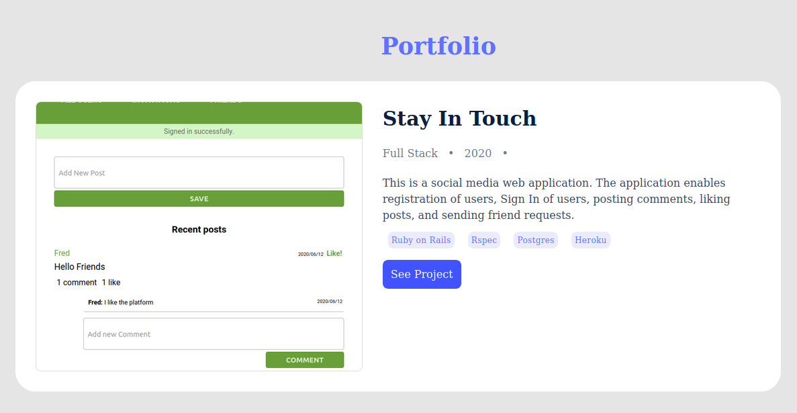

# PORTFOLIO

This project is my portfolio for showcasing the most complex projects I have built and deployed.

## Screenshot

## Online Version
 [Live Demo ](https://www.martinjoroge.tech/)

## Content

* [Built With](#built-with)
* [Author](#author)

## Built With

- HTML5
- CSS3

 

### Contributing

Contributions, issues, and feature requests are welcome!

You can do it on [issues page](issues/).

## Acknowledgments

A special thanks to all Microverse Team and Code Reviewers that guides me through my learning.

## Authors

👤 **Martin Njoroge**

- Github: [@kwizl](https://github.com/kwizl)
- Twitter: [@NjoroKaris](https://twitter.com/NjoroKaris)
- Linkedin: [Martin Njoroge](https://www.linkedin.com/in/martin-kariuki-njoroge/)
